# Can an AI judge score writing quality as well as people do?

> **This is a portfolio demonstration. The human ratings are simulated, the passage content and the model judgments are real.**

Content platforms need to score writing quality at scale, but human review is slow and expensive, so the decision is whether an LLM can stand in and which model to trust. This project benchmarks four low-cost LLM judges against a simulated human panel, grading each judge by how closely it tracks a human reviewer relative to how well two humans agree, and pairs that with full cost accounting. The result is a defensible, data-driven pick: a judge that matches human-level agreement for a fraction of a cent per passage, so quality scoring can run at scale with clear evidence behind the model choice.

**Live demo:** https://k1monfared.github.io/content_quality_evaluation_llm/ , the interactive raw-data dashboard you can open in a browser.

This study scores the writing quality of 500 real English Wikipedia passages with
four low-cost LLM judges, one per major provider, and asks how closely each judge
tracks a human reviewer compared to how closely two human reviewers track each
other. It began with a seven-dimension rubric, then ran two dimension analyses,
one on internal consistency and one that pruned the rubric to four dimensions by
how well the judges' dimension-based evaluation tracks the human holistic
judgment. The Outputs below report the final, refined-rubric results. The
methodology that follows narrates the whole journey, including both dimension
analyses and the best-case and worst-case bounds that support them.

## Outputs

### 1. Can we trust an LLM to score writing quality at scale, and which model?

Yes, closely, and the strongest judge is GPT-5.2. On this run the two human
reviewers agree at a Pearson correlation of 0.686 (intraclass correlation 0.814),
a realistic level of subjective-rating agreement, over 500 passages. That is the
human baseline. GPT-5.2 tracks the random human at 1.076 of that baseline, sitting
just above it, with a bootstrap 95 percent interval of 0.995 to 1.159 that still
includes 1.0, so it is statistically at or above the human baseline. All four
judges reach at least 0.89 of it.

| Model | Prompt | Judge-human corr | Ratio to baseline | 95 percent CI |
| --- | --- | --- | --- | --- |
| gpt-5.2 | v1 | 0.738 | 1.076 | 0.995 to 1.159 |
| claude-haiku-4.5 | v3 | 0.659 | 0.960 | 0.817 to 1.082 |
| gemini-2.5-flash | v3 | 0.616 | 0.898 | 0.810 to 0.985 |
| perplexity-sonar | v2 | 0.610 | 0.889 | 0.789 to 0.986 |

How: for each model, divide its correlation with the Monte-Carlo random human by
the human-human correlation, with bootstrap confidence intervals over the 500
passages. A ratio at or above 1.0 does not mean a judge beats people. The baseline
is capped by reviewer noise, so it means the judge tracks the debiased human as
reliably as two noisy humans track each other.

So what: an LLM judge tracks human writing-quality scoring closely enough to run
at scale, and GPT-5.2 is the accuracy pick because it sits at or just above the
human baseline on this run.

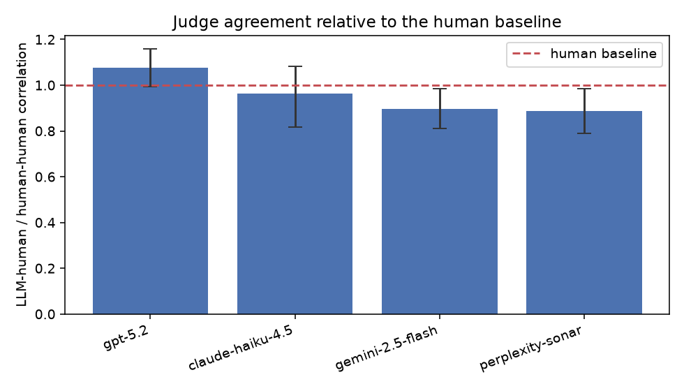

Each judge's LLM-human correlation divided by the human-human baseline, with
bootstrap 95 percent intervals and the baseline marked at 1.0.

### 2. As a good-or-bad gate, which judge is best?

Correlation captures ranking, but a platform often needs a yes-or-no call: is this
passage good enough? We label a passage good when its normalized overall score is
at least 6 on the 1 to 10 scale (210 of the 500 passages clear that bar), then
report precision, recall, and F1 for each judge against the thresholded
random-human label.

| Model | Precision | Recall | F1 |
| --- | --- | --- | --- |
| claude-haiku-4.5 | 0.635 | 0.829 | 0.719 |
| gpt-5.2 | 0.485 | 0.990 | 0.651 |
| perplexity-sonar | 0.491 | 0.952 | 0.648 |
| gemini-2.5-flash | 0.442 | 0.995 | 0.612 |

Claude Haiku 4.5 is the best gate, with the highest F1 and by far the highest
precision, because it is the least over-generous judge. The others have near
perfect recall but flag many passages the normalized human threshold rejects, a
calibration gap in the absolute cutoff rather than a ranking failure, which is why
the headline metric is correlation.

### 3. What does it cost to run at scale, and which judge is the best value?

Per-model cost and value, computed from the committed cost ledger:

| Model | Ratio to baseline | Cost per passage ($) | Per 1,000 ($) | Per 1,000,000 ($) | Agreement per dollar |
| --- | --- | --- | --- | --- | --- |
| perplexity-sonar | 0.889 | 0.0021 | 2.13 | 2,133 | 417 |
| gemini-2.5-flash | 0.898 | 0.0035 | 3.53 | 3,528 | 254 |
| claude-haiku-4.5 | 0.960 | 0.0039 | 3.91 | 3,908 | 246 |
| gpt-5.2 | 1.076 | 0.0052 | 5.20 | 5,196 | 207 |

The higher "agreement per dollar" the better. Here are the details, the three cost quantities are defined as:

$$\text{cost per passage}_m = \frac{C_m}{N_m}$$

$$\text{cost}_m(V) = V \times \text{cost per passage}_m$$

$$\text{agreement per dollar}_m = \frac{r_m}{\text{cost per passage}_m}$$

where $C_m$ is judge $m$'s total metered scoring cost over the run, $N_m$ is the
number of scoring calls it made (so cost per passage is the mean metered cost of one
scoring call, which is what you pay to score one passage once at scale), $V$ is the
target volume, and $r_m$ is judge $m$'s ratio to the human baseline from the table
above.

Agreement per dollar is the ratio to the baseline divided by the cost per passage,
so its unit is passages per dollar weighted by the fraction of the human baseline a
judge reaches. To read it, start with 1 divided by the cost per passage, which is
the raw throughput, the number of passages you can score per dollar, then multiply
by the ratio to the baseline to discount for how close the judge sits to human
agreement. Walking Perplexity Sonar through it: 1 divided by 0.0021 is about 469
passages per dollar of raw throughput, and multiplying by its 0.889 ratio gives
about 417, so about **417 passages-worth of human-level agreement per dollar**. It is a
relative value-for-money comparison across judges, not an absolute physical
quantity.

So what: the choice depends on the job. For maximum agreement, run GPT-5.2, which
sits at the human baseline. For the best value per dollar, run Perplexity Sonar,
which buys about twice the agreement per dollar of GPT-5.2 while still reaching
0.89 of the baseline. For a good-or-bad gate, Claude Haiku 4.5 has the best F1.
Every number recomputes from the ledger, so revisit as prices change.

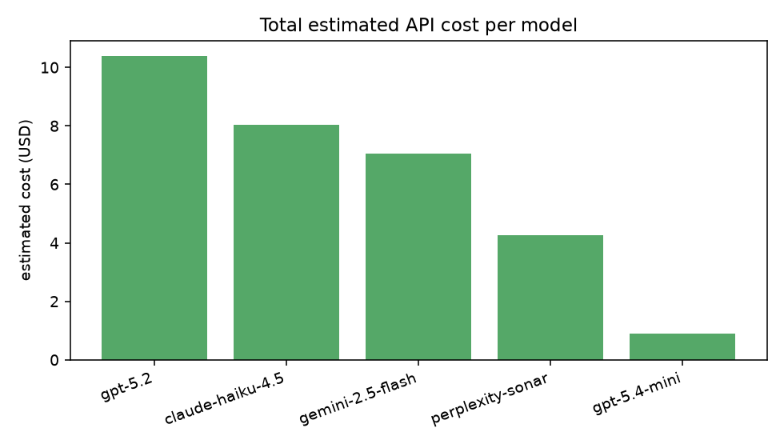

These answers rest on the pieces documented below: a simulated human panel whose
two-reviewer agreement sets the human baseline of 0.686, the correlation ratio that
grades each judge against that baseline, the two dimension analyses that refined
the rubric, and the cost ledger that meters every call.

---

## Contents

- [How to run](#how-to-run)
- [The question, precisely](#the-question-precisely)
- [Approach at a glance](#approach-at-a-glance)
- [The data](#the-data)
- [The simulated human panel, our ground truth](#the-simulated-human-panel-our-ground-truth)
- [The rubric: seven candidate dimensions](#the-rubric-seven-candidate-dimensions)
- [Dimension analysis: internal consistency and rubric reduction](#dimension-analysis-internal-consistency-and-rubric-reduction)
- [The refined rubric and the composites](#the-refined-rubric-and-the-composites)
- [The judge pipeline](#the-judge-pipeline)
- [Headline metric: the correlation ratio](#headline-metric-the-correlation-ratio)
- [Best-case and worst-case bounds](#best-case-and-worst-case-bounds)
- [Secondary metric: precision, recall, and F1](#secondary-metric-precision-recall-and-f1)
- [Rating levels: how favorably each judge scores](#rating-levels-how-favorably-each-judge-scores)
- [Cost and token accounting](#cost-and-token-accounting)
- [Reliability: JSON repair and failure tracking](#reliability-json-repair-and-failure-tracking)
- [Running a batch in parallel](#running-a-batch-in-parallel)
- [Raw-data dashboard](#raw-data-dashboard)
- [Output consistency versus temperature](#output-consistency-versus-temperature)
- [Limitations and candor](#limitations-and-candor)
- [What else could be done](#what-else-could-be-done)

## How to run

Interactive dashboard: the fastest way to see the results is the interactive
dashboard.

```bash
sh demo.sh     # serves docs/ on a free local port and opens the browser
```

`demo.sh` picks a free local port, serves the `docs/` folder over
`python3 -m http.server` bound to 127.0.0.1, opens your browser at the printed
URL, and waits until you press Ctrl-C. It needs no API key and no virtual
environment.

To reproduce the study from scratch, create a virtual environment and install the
requirements first.

```bash
python -m venv .venv
source .venv/bin/activate
pip install -r requirements.txt
```

The persona panel and the judges call live model APIs through Poe's
OpenAI-compatible endpoint, so set your key first (copy `.env.example` to `.env`
and fill it in). Fetching the data needs no key, and you can project the full cost
before spending anything:

```bash
python scripts/estimate_cost.py     # pre-run cost and call-volume projection, no API calls
```

Then reproduce the study end to end, in order:

```bash
python scripts/get_data.py            # fetch and sample the real Wikipedia passages (no key needed)
python scripts/build_assignment.py    # build the connected, balanced two-rater design
python scripts/run_human_panel.py     # run the simulated persona panel (the ground truth)
python scripts/run_prompt_eng.py      # iterative, diagnosis-driven prompt engineering on full data
python scripts/run_judges.py          # reuse each judge's best-version scores as its final scores
python scripts/analyze.py             # correlation ratio, precision/recall/F1, cost accounting
python scripts/analyze_dimensions.py  # dimension importance, pruning, composites, best/worst bounds, dashboard
python scripts/generate_figures.py    # render figures into docs/images/
```

Every API call is cached and resumable, so a re-run only calls what is missing and
never double charges. The panel and judge stages accept `--mock` for a no-network
run and `--limit` for a small smoke test, and `python scripts/run_demo.py`
exercises the whole pipeline end to end with the deterministic mock client. The
last two stages, `analyze_dimensions.py` and `generate_figures.py`, make no API
calls at all: they are pure recompute over the committed stores.

## The question, precisely

Given an encyclopedic passage, produce a writing-quality score. We want to know,
per AI model:

1. How well does its score correlate with a human reviewer's score?
2. How does that compare to how well two human reviewers agree?
3. What does it cost to run at scale?

And, along the way, which parts of the rubric actually carry the signal.

## Approach at a glance

1. Get real content. 500 paragraph-level passages of mixed quality, extracted from
   real English Wikipedia articles.
2. Build a ground-truth panel. Ten reviewer personas, each with an engineered bias,
   rate the passages on a seven-dimension rubric. Each passage is seen by two
   personas on a connected, balanced design.
3. Make the human scores comparable. Fit a model that separates each passage's
   quality from each reviewer's personal bias, then subtract the bias, on the overall
   and on every rubric dimension.
4. Set the bar. Measure how well the two human scores per passage agree. This is the
   human baseline.
5. Run the AI judges. Four low-cost models, one per major provider, score every
   passage through a cached, reproducible pipeline with versioned prompts.
6. Compare. For each model, divide its agreement with humans by the human-human
   agreement, with bootstrap confidence intervals, and report cost.
7. Refine the rubric with two analyses. First check whether each group reconstructs
   its own holistic overall from its dimensions (internal consistency), then reduce
   the rubric to the dimensions whose LLM composite best tracks the random-human
   overall.

## The data

Source: English Wikipedia ([`wikimedia/wikipedia`](https://huggingface.co/datasets/wikimedia/wikipedia), config `20231101.en`), pulled
programmatically over the Hugging Face datasets-server rows API with no
authentication. We fetch article rows and extract paragraph-level passages between
200 and 2000 characters, which vary genuinely in writing quality, and keep a
committed sample of 500 in `data/wiki_sample.csv`. If the primary source is ever
unreachable, the code falls back to [WikiText-103](https://huggingface.co/datasets/Salesforce/wikitext) automatically. Wikipedia text is
licensed CC BY-SA.

Reproduce with:

```
python scripts/get_data.py
```

## The simulated human panel, our ground truth

Real quality review is subjective. Reviewers disagree, and each carries habits:
some are lenient, some harsh, some reward depth, some reward brevity. To make a
realistic and credible ground truth, we build ten reviewer personas, each defined by
an engineered bias prompt in `prompts/personas/`:

| Persona | Bias |
| --- | --- |
| Lenient | Scores high, gives the benefit of the doubt |
| Harsh | Scores low, hard to impress |
| Depth seeker | Rewards long, thorough writing |
| Brevity lover | Rewards concise writing, punishes rambling |
| Citation stickler | Rewards sources and concrete evidence |
| Anti-hedge | Dislikes hedging, wants confident prose |
| Grammar hawk | Weights fluency, register, and clarity |
| Pragmatist | Rewards concrete, substantive content |
| Warm reader | Rewards engaging, readable tone |
| Skeptic | Distrusts confident claims, focuses on verifiability |

A single low-cost model (`gpt-5.4-mini`) plays every persona. The disagreement
comes from the prompts, not the model, which keeps the panel affordable and
controllable.

This is a portfolio demonstration, so the humans themselves are simulated. The
absolute numbers here should not be read as what real human reviewers would
produce, they illustrate the methodology rather than measure real-world
agreement. There is also a subtler wrinkle worth naming plainly: because the
personas are generated by a GPT model, even with distinct engineered biases, a
GPT-based judge might rate those simulated humans more favorably than a judge
from a different model family, simply because it shares their underlying style.
Whether that happens, and how large it is, is itself an interesting research
question, but it is not what this study is about, so we do not pursue it here.
We flag it as a threat to validity and revisit it as a future direction below.

The persona prompts alone make the panel agree more than real annotators do, so on
top of the cached persona ratings we add a deterministic, seeded reviewer noise
term to the numeric rubric scores. After the noise is added each score is rounded
to the nearest whole number and clipped to the 1 to 10 scale, so a noisy reviewer
still returns an integer rating exactly as a real reviewer would rather than a
fractional one. The panel now models a more realistic inter-reviewer agreement of
about 0.69, closer to the agreement seen in real subjective-rating studies than the
raw panel's much higher 0.752. The noise standard deviation (0.285 on the rubric
scale) is calibrated with the rounding in place so the two-reviewer Pearson baseline
lands in the 0.68 to 0.70 target band, at 0.686 (intraclass correlation 0.814), and
about 8 percent of overall ratings flip to a neighbouring integer. It is a pure
in-memory transform of the committed cache, driven by a fixed seed and a config knob
(`human_panel` in `configs/config.yaml`) so every re-run reproduces the same noisier
panel. Because it makes no API calls, the cost ledger is unchanged. See
`src/normalize.py`.

### Why two raters per passage, and why the design must be connected

Each passage is rated by exactly two personas. Which two is not arbitrary. We later
separate passage quality from reviewer bias by fitting

```
score = passage_quality + reviewer_bias + noise
```

Reviewer biases can only be compared if the reviewers are linked into a single
connected group. Picture reviewers as dots and "rated the same passage" as lines
between them. If the dots split into islands that never share a passage, there is
no way to tell whether one island scores lower because its passages are worse or
because its reviewers are harsher. So we use a connected, balanced design. The ten
personas are placed in a ring, and we use the ten neighboring pairs, (1,2), (2,3),
and so on up to (10,1). Passages are dealt round-robin across these ten pairs. The
result, verified in code, is a single connected group where every persona rates the
same number of passages (100 each for 500 passages). Connectivity makes the biases
identifiable, balance makes each estimate equally reliable.

```
python scripts/build_assignment.py
```

### Removing reviewer bias, the baseline, and the random human

We fit the additive model by least squares over the connected design, center the
estimated reviewer biases to sum to zero, and subtract each reviewer's bias from
their raw scores. After this, the two scores a passage received sit on a comparable
scale. The same additive normalization is fit and applied independently to each of
the seven rubric dimensions as well as the overall, so every human score used in the
analysis and shown on the dashboard is bias-corrected, not just the overall. The
judges are left as raw integers, since they have no per-rater bias to remove. Two
numbers then fall out:

- The human baseline: the correlation between the two reviewers' normalized overall
  scores across passages, reported alongside an intraclass correlation as a
  robustness check. On this run it is a Pearson correlation of 0.686 (intraclass
  correlation 0.814) over 500 passages. This is the most agreement any single grader
  can expect.
- The random human, built by Monte-Carlo simulation: averaging a passage's two
  scores would hide disagreement and make the panel look artificially consistent, so
  instead, for each passage we randomly pick one of its two human evaluations, which
  gives one full random-human evaluation set across all 500 passages, and we repeat
  that draw 1000 times with a fixed seed. Averaging the 1000 sets per passage gives
  the Monte-Carlo random human, one score per passage. It is the target the judges
  are correlated against. By the law of large numbers it converges to the per-passage
  mean of the two humans, but at 1000 iterations it is close to, and not exactly, that
  mean: on this run the Monte-Carlo random human differs from the exact simple average
  by 0.008 points on average and 0.064 points at most, correlating with it at 0.99992.
  So the two are all but identical, with a small seeded residual that shrinks as the
  iteration count grows, and the simulation is what carries the panel's real spread
  into the draw rather than a smoothed consensus.

See `src/normalize.py` and `src/montecarlo.py`. The random-human comparison figures
are written to `outputs/random_human_comparison.json`.

## The rubric: seven candidate dimensions

Every reviewer, human persona or AI judge, is asked for the same JSON shape: a short
reason then an integer score from 1 to 10 for each dimension, and then a separate,
holistic overall score. The overall is a direct, independent judgment and is
explicitly not required to be the average of the dimensions, so we can later compare
it against computed composites of the dimensions. The overall score is the target of
the analysis.

The rubric began with seven candidate dimensions, grounded in Wikipedia's own
content policies and quality criteria. Overlap between them was expected and
intentional, to be pruned by a later analysis. From `src/rubric.py`:

| Dimension | What it measures |
| --- | --- |
| clarity | Is the passage clear and easy to understand on a first read? |
| neutrality | Is the tone neutral and impartial, free of bias or promotion? |
| verifiability | Do the claims appear sourced or attributable rather than unsupported? |
| coverage | Does the passage cover its topic adequately for its scope? |
| structure | Is it well organized and coherent, with ideas that flow logically? |
| readability | Is the language fluent, grammatical, and in an encyclopedic register? |
| informativeness | Does it convey substantive, useful information efficiently? |

Every field is scored on the same anchored 1 to 10 scale, with 1 unusable, 4 poor to
fair, 7 good, and 10 exceptional, plus a per-dimension meaning for the endpoints
written into the prompt so every rater uses the same scale. Forcing a short reason
before each number pushes the rater to think before committing.

## Dimension analysis: internal consistency and rubric reduction

Seven overlapping dimensions is more than the signal needs. We study them with two
separate analyses, and it is important not to conflate them. The first is
descriptive and asks whether each group of raters is internally consistent. The
second is what actually reduces the rubric, and it is driven by a different
question: how well a judge's dimension-based evaluation tracks the human holistic
judgment. Both run in:

```
python scripts/analyze_dimensions.py
```

### Analysis 1: internal consistency, per rater

For each rater on its own, we regress that rater's direct overall on its own
dimension scores and compare two composites against that same direct overall: the
flat equal-weight average and the fitted least-squares average. This measures
nothing about agreement between raters. It only asks whether each rater
reconstructs its own holistic overall from its own dimensions, and whether the flat
or the weighted composite does it better. The two humans and the random human use
the normalized dimensions, the judges their raw dimension scores.

| Rater | Flat composite vs own overall | Fitted composite vs own overall | Better |
| --- | --- | --- | --- |
| human_1 | 0.848 | 0.874 | fitted |
| human_2 | 0.878 | 0.901 | fitted |
| random_human | 0.904 | 0.928 | fitted |
| gpt-5.2 | 0.948 | 0.952 | fitted |
| claude-haiku-4.5 | 0.883 | 0.930 | fitted |
| gemini-2.5-flash | 0.927 | 0.935 | fitted |
| perplexity-sonar | 0.965 | 0.969 | fitted |

Every rater is internally consistent, and the judges more so than the individual
humans, which is expected because a model applies its rubric more mechanically than
a noisy human does. For every rater the fitted weighted composite reconstructs the
direct overall better than the flat one, so across the four judges the weighted
composite is the more internally consistent form. This result feeds the next
analysis, which uses the fitted judge composite.

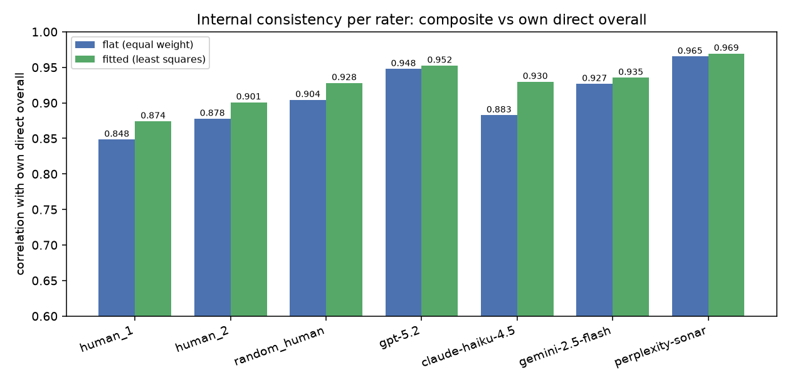

### Analysis 2: reducing the rubric by the LLM-to-random-human match

The pruning is not driven by contribution to the human overall. A good judge is one
whose dimension-based evaluation tracks the human holistic judgment, so we prune by
how well the LLM composite of the dimensions matches the random-human overall,
aggregated across the four judges. The steps:

1. Pick the composite type more internally consistent for the judges. From Analysis
   1 that is the fitted weighted composite.
2. Using that fitted LLM composite, find the dimension subset that maximizes the
   correlation between the LLM composite and the Monte-Carlo random-human overall,
   averaged over the four judges.

#### The dimensions are collinear

The seven dimensions overlap heavily, computed here on the normalized human scores.
Two clusters and one loner stand out: a prose cluster where clarity, structure, and
readability correlate at 0.81 to 0.84, a substance cluster where coverage and
informativeness correlate at 0.79, and neutrality apart from everything, correlating
at most 0.28 with any other dimension. Collinearity is the reason a whole member of a
cluster can be dropped at almost no cost: a kept sibling already carries the shared
signal.

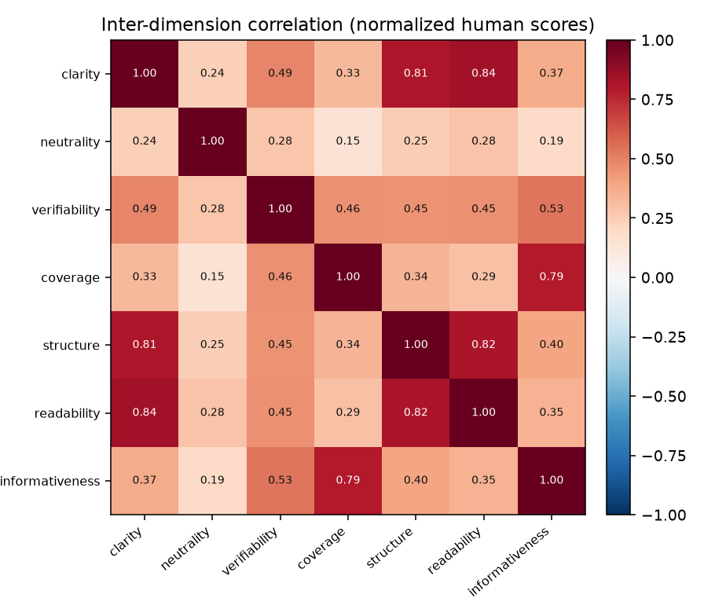


#### Two distinct diagnostics

It is important not to conflate the two things below.

The **drop-one importance** diagnostic removes exactly one dimension while keeping the
other six, to measure that one dimension's marginal importance. The match value in
the table is the match **after** that single removal, and the all-seven baseline is
0.668, so a positive change means removal raised the match (the dimension is
redundant or uninformative for this matching) and a negative change means removal
lowered it (the dimension carries unique signal). This is a per-dimension view, not a
recipe for choosing the subset.

| Dimension | Match after removing only this one | Change vs all seven | Reading |
| --- | --- | --- | --- |
| verifiability | 0.6585 | -0.0096 | unique signal |
| readability | 0.6604 | -0.0077 | unique signal |
| coverage | 0.6665 | -0.0016 | unique signal |
| structure | 0.6673 | -0.0008 | unique signal (marginal) |
| neutrality | 0.6683 | +0.0002 | neutral |
| informativeness | 0.6687 | +0.0006 | redundant |
| clarity | 0.6718 | +0.0037 | redundant |

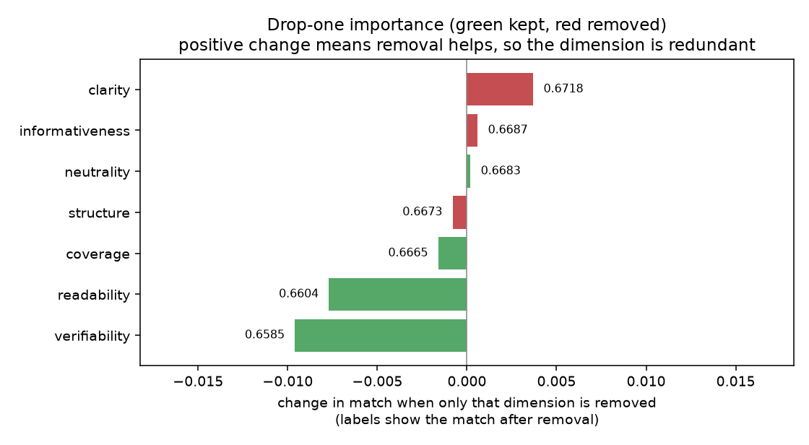

The **subset selection** is a different procedure: greedy backward elimination. Start
from all seven dimensions, remove the single dimension whose removal most raises the
match, then from the remaining set remove the next such dimension, cumulatively,
stopping when no further removal improves the LLM-composite-to-random-human match.
Backward elimination is used precisely because the dimensions are collinear: two
correlated dimensions can be jointly removable even when neither alone helps, since
each covers for the other in the drop-one view, and only a cumulative procedure can
peel them off one after another.

| Step | Removed | Remaining size | Match after removal |
| --- | --- | --- | --- |
| 0 | none (all seven) | 7 | 0.6681 |
| 1 | clarity | 6 | 0.6718 |
| 2 | informativeness | 5 | 0.6738 |
| 3 | structure | 4 | 0.6739 |

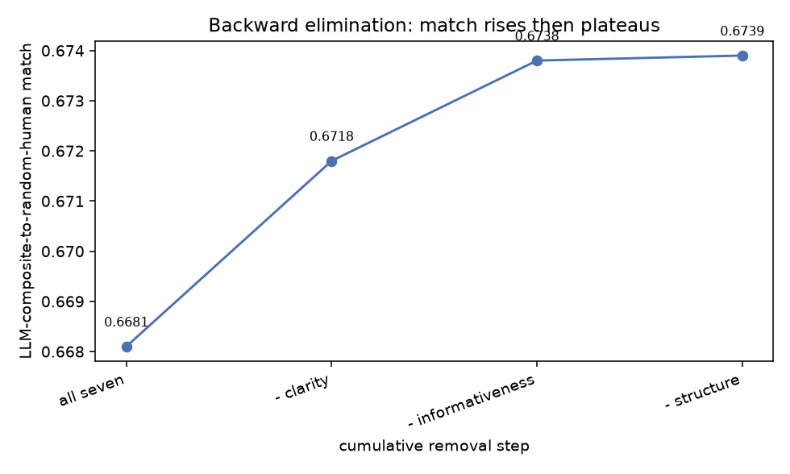

The match rises then plateaus, and elimination stops at four dimensions. To confirm
the greedy result is not an artifact, we run a full factorial over dimension subsets:
every include-or-exclude combination of the seven dimensions, all 127 non-empty
subsets, scored exhaustively rather than sampled. It agrees. The best subset of size
four, **neutrality, verifiability, coverage, and readability**, is the single best
subset of any size at 0.6739, edging the best size five (0.6738) and beating the full
seven (0.6681). The best-achievable-match-by-subset-size view below is that factorial
summarized one size at a time.

| Subset size | Best achievable match | Best subset of that size |
| --- | --- | --- |
| 1 | 0.5887 | informativeness |
| 2 | 0.6529 | coverage, readability |
| 3 | 0.6729 | verifiability, coverage, readability |
| 4 | 0.6739 | neutrality, verifiability, coverage, readability |
| 5 | 0.6738 | + structure |
| 6 | 0.6718 | drop clarity |
| 7 | 0.6681 | all seven |

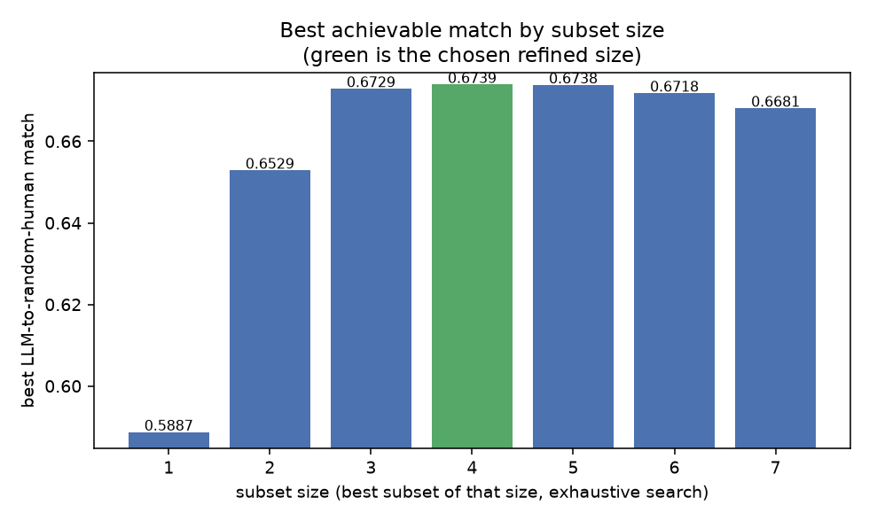

#### The refined rubric and why these four

The refined rubric is the four dimensions whose fitted LLM composite best tracks the
random human: **neutrality, verifiability, coverage, and readability**. Dropped are
clarity, structure, and informativeness.

Why drop a dimension as clearly relevant to writing quality as clarity? Redundancy,
not irrelevance. Clarity sits in the collinear prose cluster with structure and
readability (mutual correlations 0.81 to 0.84), and once readability is kept as that
cluster's representative it already carries the shared signal, so clarity adds only
correlated noise to the match. The same holds for structure, which is why it drops in
the third backward step even though its own drop-one change is a marginal -0.0008:
after clarity is gone it is redundant with readability. This does not mean clarity or
structure is unimportant to writing quality in general, only that it adds nothing
beyond the kept dimension for reconstructing the human holistic overall.

This is deliberately a different result from what a human-overall reconstruction
would give. The full-rubric weights that best reconstruct a human's own holistic
overall are led by informativeness, yet informativeness is dropped for the matching
objective because its judge scores add noise to that particular match while its
substance-cluster sibling coverage is kept.

| Dimension | Fitted weight reconstructing the human overall (full rubric) |
| --- | --- |
| informativeness | 0.272 |
| verifiability | 0.192 |
| structure | 0.156 |
| coverage | 0.149 |
| clarity | 0.148 |
| readability | 0.081 |
| neutrality | 0.047 |

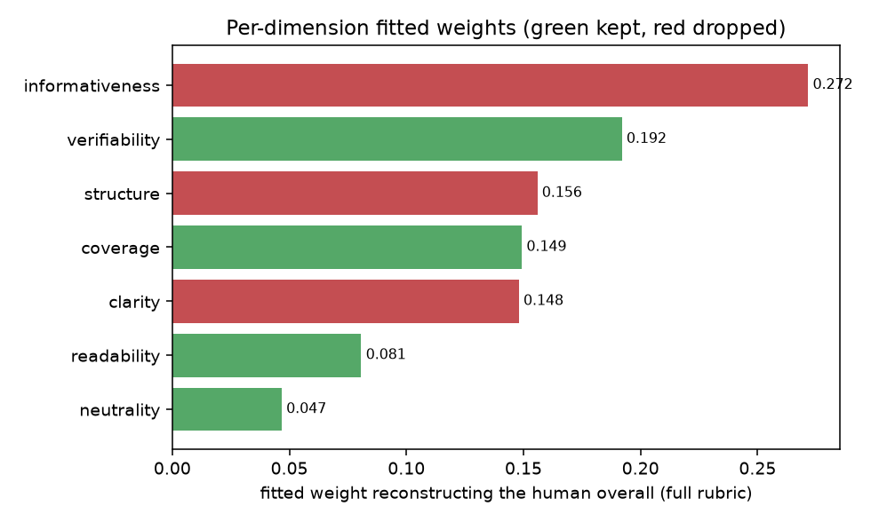

Verifiability, coverage, and readability are concrete, surface-checkable qualities
that the models score consistently and that move with the human holistic judgment.
Neutrality is retained even though it barely reconstructs the human overall, because
it does not hurt the LLM-to-random-human match and the four-dimension subset that
includes it is the joint maximum.

## The refined rubric and the composites

The dashboard shows, for every rater, two composites of the refined four dimensions:
a flat equal-weight average and a fitted-weight average. The fitted weights are the
least-squares reconstruction of the direct human overall from those four dimensions,
applied uniformly to every rater so the composites are comparable: neutrality 0.049,
verifiability 0.277, coverage 0.414, and readability 0.314 (intercept -0.106).

It is worth being explicit that the refined set was chosen to maximize the
LLM-to-random-human match, not to reconstruct the human overall, so as a plain
reconstruction of the human overall it is weaker than the full rubric. The flat
composite of the four refined dimensions correlates with the direct human overall at
0.794 and the fitted at 0.850, against 0.863 and 0.887 for the full seven dimensions.
That is expected and not a defect: the refined rubric drops the dimensions, led by
informativeness, that most reconstruct a human's own holistic score but that do not
help the judges' composite track the human, and it keeps the concrete,
surface-checkable dimensions that do.

One deliberate choice is worth stating. Any composite is far more inter-rater
reliable than the direct overall: the flat composite's two-reviewer correlation is
0.837 for the refined rubric and 0.843 for the full one, against 0.686 for the direct
overall, because averaging dimensions cancels reviewer noise. It would be tempting to
use a composite as the ground truth, which would mechanically raise the human baseline
to about 0.84 and change every judge ratio. We do not. The direct, holistic overall is
the genuine independent human judgment and the harder, more faithful target, so it
remains the ground truth.

Because the judge ratios and the human baseline are computed on that direct overall,
which every rater gives independently, reducing the rubric does not change the headline
results. The refined rubric changes which dimensions we treat as the informative core,
and the two analyses above are what justify it.

## The judge pipeline

A single function, `evaluate(content, model, version)`, sends a passage to a model
with that model's current prompt, parses the JSON reply into the rubric fields, and
appends the record to a CSV database. If the reply cannot be parsed, it is sent to a
cheap repair model before being given up on. Every evaluation is persisted, so
re-runs reuse cached results and never pay twice. All calls use temperature 0.
Access is through Poe's OpenAI-compatible endpoint, so one client reaches every
provider.

The four judge models are the cheaper tier of each major provider. The two expensive
Pro tiers (gemini-2.5-pro, perplexity-sonar-pro) are traded to their cheaper tiers,
and Anthropic uses the Haiku tier, so the full-data run at four prompt versions over
all 500 passages fits the budget:

- `gpt-5.2` (OpenAI)
- `claude-haiku-4.5` (Anthropic)
- `gemini-2.5-flash` (Google)
- `perplexity-sonar` (Perplexity)

### Prompt engineering as an iterative, data-driven loop

Prompts are not fixed. For each model we run a genuine refinement loop of up to four
versions (v1 to v4), saved under `prompts/judge/<model>/`. Starting from a minimal
base prompt, each version is scored on all 500 passages against the human panel, the
disagreement is diagnosed, and targeted corrective guidance is appended to produce the
next version. The loop is automatic and reproducible, the machine analogue of a
reviewer reading the disagreements and editing the prompt. The mechanism, in
`src/prompt_tuning.py`, has three concrete steps.

The diagnosis compares the judge's overall scores to the per-passage normalized human
overall (the tuning target) and to passage length, and computes four signals: the
Pearson and Spearman correlation with the human overall (the ranking signal), the
level bias, which is the judge's mean overall minus the human mean, so a positive value
means the judge scores systematically too high, the spread ratio, which is the judge's
score standard deviation divided by the human's, so a value below 1 means the judge
compresses its scores into the middle and a value above 1 means it over-uses the
extremes, and the length-residual correlation, which correlates passage length with the
judge's per-passage residual (its z-scored overall minus the human z-scored overall) to
detect a judge that rewards or punishes passages for their length rather than their
quality.

That diagnosis is turned into corrective guidance by fixed rules, not free generation.
Each rule fires on a measured threshold and selects one entry from a small library of
canned instructions. A length-residual correlation above 0.20 selects the guidance not
to reward a passage merely for being long, below -0.20 the guidance not to penalize a
thorough passage for its length. A spread ratio below 0.75 selects an instruction to
use the full 1 to 10 range and separate weak, average, and strong passages, above 1.40
an instruction to avoid unwarranted extreme scores. A level bias above +0.5 selects
"you have been scoring too generously, be more critical and reserve 8 or higher for
genuinely excellent passages," and below -0.5 the harsh-side counterpart. A
general-purpose "judge substance before style" nudge is always available as a fallback.
The most salient not-yet-applied rule is chosen, with the ranking fixes (length,
substance) preferred over the calibration fixes (spread, level) because correlation is
invariant to level and scale and only the ranking fixes can move it.

That guidance is appended, not rewritten in. The next version is the base prompt with
the accumulated corrections added as a bulleted block under the heading "Additional
calibration guidance learned from reviewer disagreement," followed by a reminder to
return only the requested JSON. The corrections accumulate across versions, and each
new version is re-scored on the full 500 passages and diagnosed again. Because the loop
scores the full data, the best version per model, the one with the highest full-data
correlation with the human overall, is reused directly as that model's final judge
scores, so there is no separate final judge run.

```
python scripts/run_prompt_eng.py
```

How much the loop helped, measured as the full-data correlation with the human panel
overall from the first version to the version carried forward:

| Model | v1 correlation | Best version | Best correlation | Change from v1 |
| --- | --- | --- | --- | --- |
| perplexity-sonar | 0.581 | v2 | 0.610 | +0.029 |
| claude-haiku-4.5 | 0.643 | v3 | 0.660 | +0.017 |
| gemini-2.5-flash | 0.614 | v3 | 0.616 | +0.002 |
| gpt-5.2 | 0.738 | v1 | 0.738 | +0.000 |

The gains are small. GPT-5.2 was already best at v1 and no edit improved it, while
the corrective edits bought Perplexity and Claude a couple of hundredths. The lesson
is that on a realistically noisy panel the small prompt edits move agreement by only
hundredths, so their apparent ranking is within noise and none is a decisive win.
These full-data tuning correlations nearly equal the headline judge-human
correlations, because both compare the judge against essentially the same target: the
per-passage mean of the normalized human overall here, and the Monte-Carlo random
human in the headline, which converges to that same mean.

The per-version table is written to `outputs/prompt_eng_results.csv` and the selected
versions to `outputs/best_prompt_versions.json`.

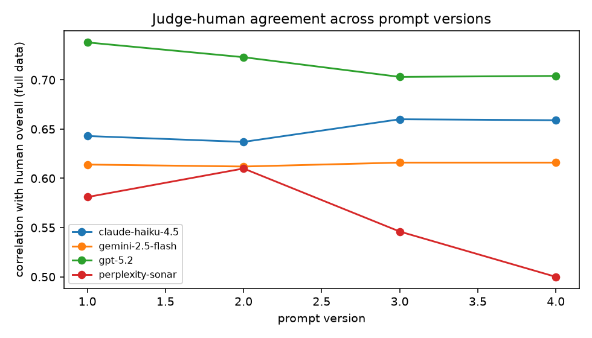

## Headline metric: the correlation ratio

For each model:

```
ratio = correlation(judge, Monte-Carlo random human) / correlation(reviewer A, reviewer B)
```

We compute a bootstrap confidence interval by resampling passages with replacement,
recomputing both correlations each time. The human baseline is a Pearson correlation
of 0.686 between the two reviewers per passage (intraclass correlation 0.814) over
500 passages. The final results, best first, are the headline table in Output 1
above: GPT-5.2 at 1.076 of the baseline, just above it with an interval that still
includes 1.0, then Claude Haiku 4.5 at 0.960, Gemini 2.5 Flash at 0.898, and
Perplexity Sonar at 0.889. A ratio at or above 1.0 is possible and does not mean a
judge beats human judgment. The baseline is limited by reviewer noise, so a consistent
judge can track the debiased human as reliably as two noisy humans track each other.

A note on the target. The judges are correlated against the Monte-Carlo random human,
the average of 1000 seeded random-pick evaluation sets described earlier, not against
a single random draw per passage. Correlating against this averaged random human,
which is all but identical to the per-passage mean of the two reviewers, gives a
higher and more stable number than averaging the judge's correlation across many
noisy single-draw random humans would, because the averaging cancels the per-passage
sampling noise in the target rather than propagating it into the correlation. That is
why every judge here sits higher against the baseline than a single-draw target would
place it, and it is the reason the headline correlations now line up with the
full-data prompt-tuning correlations, which use the same smooth mean-human target.

```
python scripts/analyze.py
python scripts/generate_figures.py
```

Result tables land in `outputs/` and figures in `docs/images/`.

## Best-case and worst-case bounds

The random-human ratio uses the Monte-Carlo random human, which converges to the
per-passage mean of the two reviewers, so it assumes users split evenly between them.
That is an optimistic average. To bound how much better or worse a judge could look,
for each passage we take the judge's absolute overall distance to each of the two
humans. The nearer human is the best case, the farther the worst case. Best case is
what a user who happens to align with the judge would see, worst case is what happens
if every user skews to the less-agreeing reviewer.

| Model | Worst-case corr | Random corr | Best-case corr | Worst-case MAD | Random MAD | Best-case MAD |
| --- | --- | --- | --- | --- | --- | --- |
| gpt-5.2 | 0.596 | 0.738 | 0.798 | 1.267 | 0.945 | 0.691 |
| claude-haiku-4.5 | 0.478 | 0.659 | 0.773 | 0.981 | 0.659 | 0.505 |
| gemini-2.5-flash | 0.529 | 0.616 | 0.648 | 2.319 | 1.996 | 1.695 |
| perplexity-sonar | 0.417 | 0.610 | 0.713 | 2.107 | 1.784 | 1.499 |

As fractions of the 0.686 baseline, GPT-5.2 ranges from 0.87 in the worst case to
1.16 in the best, and it has the strongest worst-case correlation of the four. The
mean-absolute-difference columns tell a complementary story: Claude Haiku 4.5 is the
best-calibrated judge, with the tightest distances to the humans, while Gemini and
Perplexity sit two full points away on average because they over-score, which is the
same miscalibration that depresses their gate precision. The worst case is the number
to plan against if you cannot assume users are averaged across reviewers.

The bounds are written to `outputs/best_worst_bounds.csv`.

## Secondary metric: precision, recall, and F1

The gate results are the table in Output 2 above. Recall is high across the board, so
the judges rarely miss a genuinely good passage. Precision is lower because the judges
are more generous than the bias-normalized human threshold: after normalization 210 of
500 passages clear the bar of 6, while the judges flag more. Claude Haiku 4.5 is the
exception and the best gate, because it is the least over-generous. This is a
calibration gap in the absolute cutoff, not a ranking failure, which is exactly why the
headline metric is correlation. A production gate would calibrate the threshold per
model or use the score as a triage rank rather than a hard cut. The rating-levels
section below quantifies this generosity per judge.

## Rating levels: how favorably each judge scores

Correlation measures ranking and is blind to level, so a judge can track the human
ordering perfectly while sitting a full point too high. This section measures level
directly, using the real raw overall scores on the 1 to 10 scale rather than the
bias-normalized values, and asks how favorably each rater scores. The two-human
average is 5.75, and the per-passage minimum and maximum of the two reviewers,
averaged, give a human band of 5.31 to 6.19. The Monte-Carlo random human sits at
5.75, on top of the two-human average as expected.

| Rater | Mean overall | Relative to the humans |
| --- | --- | --- |
| gemini-2.5-flash | 7.69 | far above the human max (6.19), the most generous |
| perplexity-sonar | 7.05 | well above the human max, second most generous |
| gpt-5.2 | 6.59 | above the human max, moderately generous |
| max of two humans | 6.19 | top of the human band |
| human_1 | 5.76 | |
| random human | 5.75 | equals the two-human average |
| human_2 | 5.74 | |
| claude-haiku-4.5 | 5.45 | inside the human band, below the average, the only judge near human level |
| min of two humans | 5.31 | bottom of the human band |

The ordering by generosity is Gemini, then Perplexity, then GPT-5.2, then Claude
Haiku, which closely tracks the inverse of the gate precision ordering (Claude 0.635,
Perplexity 0.491, GPT-5.2 0.485, Gemini 0.442), with only GPT-5.2 and Perplexity
swapping by a hundredth. This is the quantified form of the high-recall, low-precision
pattern from the gate metric: three of the four judges
score so far above the human average that at a fixed cutoff of 6 they flag many
passages the bias-normalized human threshold rejects, so they miss almost nothing
(high recall) but over-flag (low precision). Claude Haiku is the exception because it
is the only judge whose level sits inside the human band, just below the average,
which is why it is the least over-generous and the best gate.

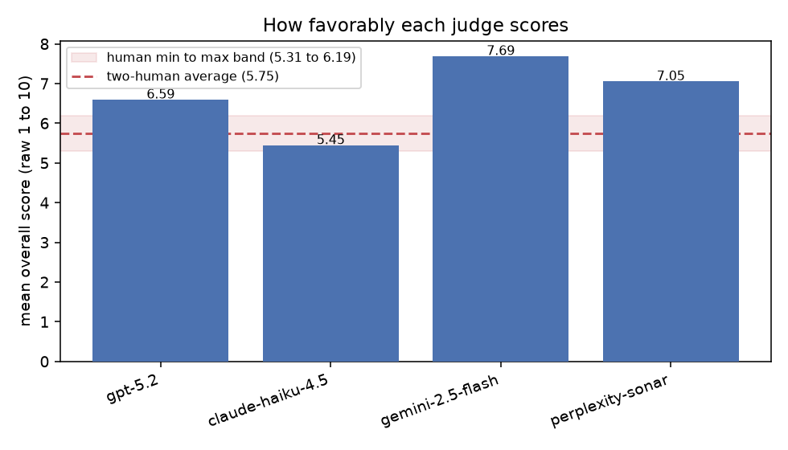

The box plots show this is a shift in level, not only in the mean: the whole
distribution of each generous judge is lifted, and Gemini and Perplexity are also more
dispersed toward the top of the scale.

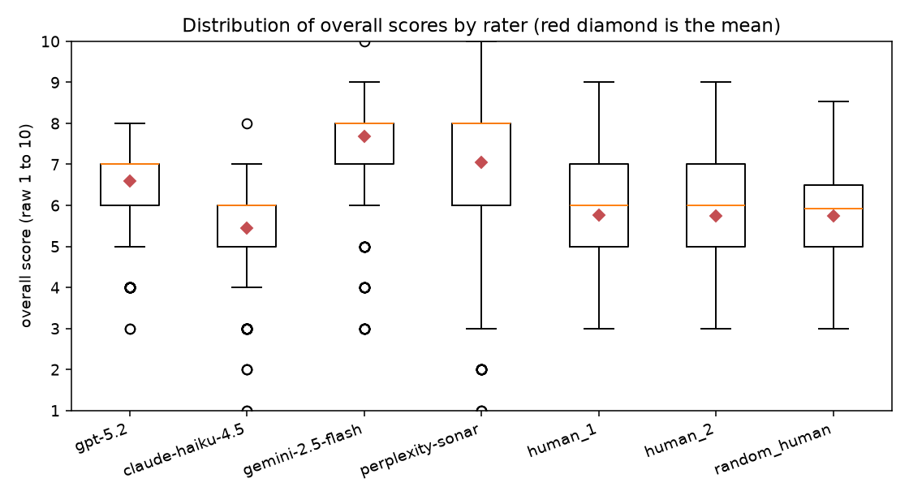

At the dimension level the generosity is not uniform. The mean raw score of each
rater by dimension, against the two-human dimension average as the reference, is:

| Rater | clarity | neutrality | verifiability | coverage | structure | readability | informativeness | overall |
| --- | --- | --- | --- | --- | --- | --- | --- | --- |
| human reference (two-human average) | 6.56 | 8.23 | 5.03 | 4.87 | 6.74 | 6.49 | 6.00 | 5.75 |
| gpt-5.2 | 6.98 | 8.11 | 4.99 | 5.78 | 6.91 | 6.95 | 7.14 | 6.59 |
| claude-haiku-4.5 | 7.10 | 7.44 | 4.99 | 5.22 | 6.86 | 7.09 | 5.82 | 5.45 |
| gemini-2.5-flash | 8.00 | 9.30 | 7.52 | 7.65 | 8.13 | 8.40 | 8.40 | 7.69 |
| perplexity-sonar | 7.51 | 9.08 | 6.66 | 6.86 | 7.46 | 7.45 | 7.39 | 7.05 |

The judges inflate the checkable substance dimensions coverage and verifiability the
most, where the humans are harshest, and Gemini and Perplexity inflate them the most
of all. GPT-5.2 stays closest to the human reference on the checkable dimensions, and
Claude Haiku is the only judge that scores some dimensions below the humans, notably
neutrality and informativeness, which is consistent with it being the least generous
overall. The heatmap below shows each judge's per-dimension delta from the human
reference, so red is inflation and blue is deflation.

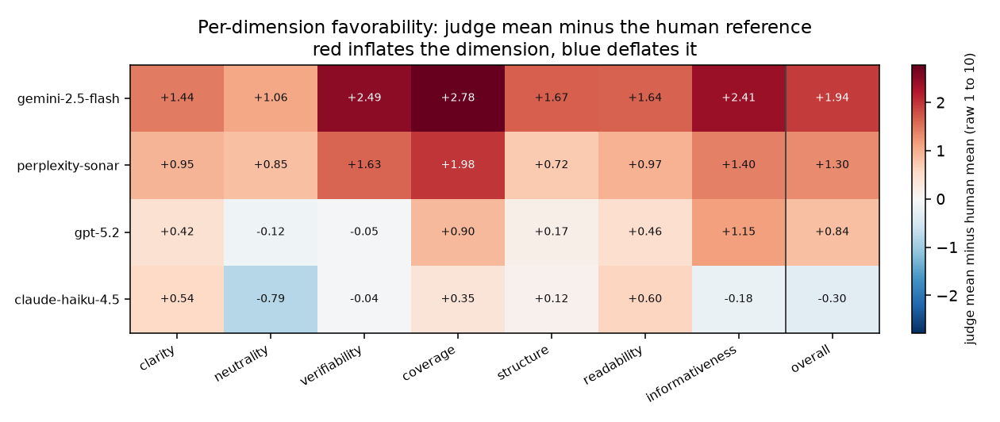

The per-rater levels are written to `outputs/rating_levels.csv`,
`outputs/rating_levels_dimensions.csv`, and `outputs/rating_levels_overall.csv`.

## Cost and token accounting

Every API call, whether a persona rating, a prompt-engineering trial, or a judge
evaluation, writes one row to a dedicated bookkeeping store
(`outputs/api_cost_log.csv`) with the model, role, prompt version, item, input and
output tokens, token source, estimated cost, and latency. Costs come from a small,
configurable price table in `configs/prices.yaml`, expressed as dollars per million
input and output tokens. These prices are
documented as representative planning approximations that you can edit, after which
every downstream number updates automatically. A pre-run projection is available
without spending anything:

```
python scripts/estimate_cost.py
```

### What the run actually cost

The full run made 9,061 API calls, used about 9.11 million input tokens and 7.21
million output tokens, and cost about 30.74 dollars in total, all figures from live
API usage. That total covers everything: the 1,000 persona ratings, the full-data
prompt engineering across four versions and four judges, and the JSON repair calls.
The cost per judge evaluation reported in `outputs/cost_summary.json` divides the
total spend by the 8,006 judge evaluations actually performed, which is about 0.0038
dollars per evaluation and reconciles with the per-model table, rather than by the
handful of connectivity smoke calls.

The number that matters for scaling is the per-passage cost of each judge and how it
trades off against agreement, which is the cost and value table in Output 3 above.
Perplexity Sonar is the cheapest and best value per dollar, GPT-5.2 is the strongest
and mid-priced, and Gemini and Perplexity carry higher output-token counts because of
reasoning or verbose completions.

## Reliability: JSON repair and failure tracking

Models do not always return clean JSON. The pipeline handles this in three layers:
tolerant parsing that extracts the JSON object from surrounding text and accepts both
the nested reason-then-score form and a bare number per field, automatic repair that
sends an unparseable reply to a cheap model (Claude Haiku) that reformats it
into schema-correct JSON, and a failure store that records anything still unusable
with a reason (api_error, empty, refusal, no_json, schema_error).

On this run the unrecoverable failure rate was zero across all 8,006 judge
evaluations, with a 100 percent parse success rate. Repair rescued 55 replies, 35 from
Gemini, 12 from Perplexity, and 8 from Claude Haiku, and every repair call is logged in
the cost ledger like any other call. Raise `api.max_tokens` in the config if you see
truncated reasoning-model replies, and the repair model is set under `repair` in
`configs/config.yaml`.

## Running a batch in parallel

The API stages run through a bounded thread pool, since the calls are independent per
passage and per model and temperature 0 keeps them order-independent. Results and
their reproducibility are unaffected by concurrency, because every result is cached by
call key and the CSV writes are lock-guarded.

For a user handing in their own content, `src/batch.py` exposes a clean entry point,
`evaluate_batch(items, models, cfg, ...)`, demonstrated by `scripts/run_batch.py`:

```
python scripts/run_batch.py                    # default concurrency
python scripts/run_batch.py --max-workers 24   # push harder
python scripts/run_batch.py --model gpt-5.2 --limit 20
```

When the provider starts rate limiting, the controller halves the number of in-flight
calls and adds exponential backoff, then recovers one step at a time as calls succeed
again, so a rate-limited user degrades gracefully instead of failing.

## Raw-data dashboard

`docs/index.html` is a self-contained dashboard with a row per passage, all 500,
showing the passage text and every rater scored on the full rubric. The two humans
and the random human are shown bias-normalized on every dimension and on the overall,
the per-rater additive bias removed, so their cells are continuous. The four judges
are not bias-corrected, so their per-dimension and overall cells are the raw integer
ratings shown as given. For every rater, the two humans, the random human, and all
four judges, it shows both composites of the refined four dimensions, the flat
equal-weight average and the fitted-weight average, plus a good-or-bad flag at the
normalized threshold of 6. Each judge additionally shows three deltas against the humans: the min
delta to the closer human (best case), the max delta to the farther human (worst
case), and the random-human delta, which is marked as the per-item basis of the
headline metric, each judge's correlation with the random human. Each judge also
carries a good-or-bad match column showing whether its threshold decision agrees with
the random human's, green for a match and red for a mismatch. Human cells are colored
red at 1 to green at 10, judge cells run white when far from the average human to blue
when they match, and the flag columns are green for agreement and red for disagreement.
The table has a sticky header and is sortable and filterable. It is rebuilt by
`scripts/analyze_dimensions.py`. Open it directly in a browser or serve the `docs/`
folder.

## Output consistency versus temperature

This side experiment measures how stable a single judge's scores are when the
same passage is scored over and over. It isolates one judge, one prompt, and one
passage, and varies only the sampling temperature. The goal is to separate two
sources of the judge disagreement seen in the main study: genuine differences in
judgment between models versus mere sampling noise inside one model.

### Setup

The passage is item_0105, the single passage on which the four study judges
disagreed most. Their overall scores on it span the full usable range: the
claude-haiku-4.5 judge gave 1, gpt-5.2 gave 5, perplexity-sonar gave 8, and
gemini-2.5-flash gave 10 (overall variance 11.5, the largest of all 500
passages, and also the largest mean across-dimension variance). The passage is a
bare bibliographic citation rather than a prose paragraph, so the judges split
on whether it should be scored as a well formed reference entry or rejected as
non-encyclopedic content. It is an ideal stress test for scoring stability.

The judge is claude-haiku-4.5 with its selected best prompt (v3) and the study's
rubric and anchors, exactly as in the main run. The passage was scored 300 times
at each temperature in {0, 0.1, 0.2, ..., 1.0}, for 3300 scored draws in total.
Each draw records the overall score plus all seven dimension scores. Calls were
cached so an interruption never repeated a completed draw, and the spend was
tracked in a ledger separate from the main study's cost log.

Before the sweep, temperature was confirmed to be honored for this model: a short
creative prompt returned four identical completions at temperature 0 and four
distinct completions at temperature 1.0. Temperature is therefore a real,
effective control here, not a silently ignored parameter.

### The temperature-0 determinism result

At temperature 0 the judge is fully deterministic on this passage. All 300 draws
were byte-for-byte identical: the same overall score of 1, the same seven
dimension scores, and the same written rationale every time. The overall score
had zero variance and exactly one distinct value across all 300 calls. In other
words, at temperature 0 repeated scoring adds no noise at all, and a single call
is a complete summary of what the judge will say. This is the core finding, and
it justifies the main study's choice to run every judge at temperature 0 for
reproducibility.

### How variability and the average change as temperature rises

Any temperature above 0 breaks that determinism immediately. Even at temperature
0.1 the overall score starts taking neighbouring values, and the standard
deviation jumps from 0 to about 0.5. The average also shifts up at once: the mean
overall rises from 1.00 at temperature 0 to roughly 1.6 for every positive
temperature, an increase of about 0.6 of a point that appears as soon as
sampling is enabled and then stays roughly flat. This is a discrete step, not a
gradual drift. The reason is a floor effect. At temperature 0 the score is pinned
at the scale minimum of 1, so sampling can only move it upward, and the mean
lifts the moment the distribution is allowed to spread.

The overall score itself stays fairly concentrated across the whole range. The
median is 2 at every positive temperature and the interquartile range is a single
point wide throughout, so the typical draw is a 1 or a 2 regardless of
temperature. What grows with temperature is the tail. The maximum sampled overall
score climbs from 3 at low temperature to 5, 6, and 7 at the high end, and the
standard deviation widens from about 0.5 to about 0.7. So higher temperature does
not move the center of the overall score much, it mainly adds rare high outliers.

The dimension scores are far more volatile than the overall score, and this is
where most of the temperature-driven inconsistency lives. Per-dimension standard
deviations rise from 0 at temperature 0 to between about 1 and 2.8 points at high
temperature. The coverage dimension is the most unstable: the model increasingly
cannot decide whether a citation can be scored for coverage at all, and at higher
temperature it more and more often writes a non-numeric "N/A" for coverage
instead of an integer. The rate of such schema violations climbs from 0 at
temperature 0 to roughly a quarter of all draws at the highest temperatures. That
rising N/A rate is itself a form of output inconsistency: the same input yields a
schema-valid response most of the time and a schema-violating one a growing
fraction of the time as temperature increases.

### Figures

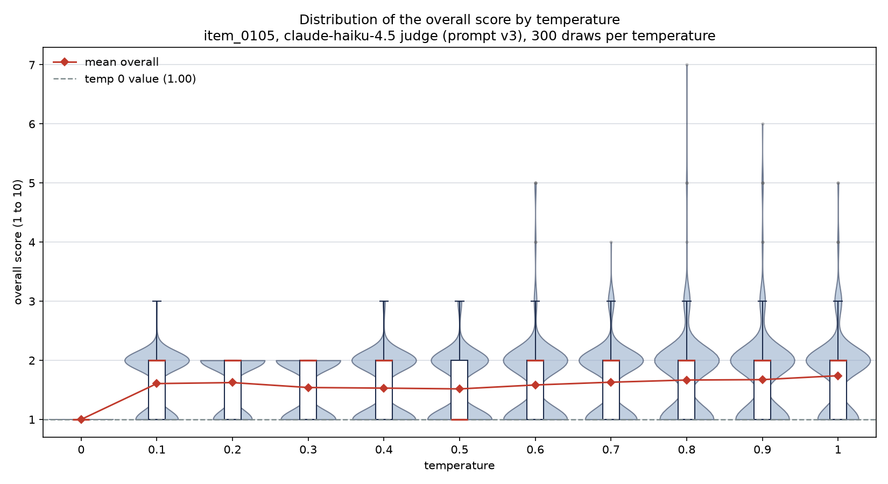

Distribution of the overall score at each temperature. Temperature 0 is a single point at 1, and the spread and upper tail grow with temperature while the median stays at 2.

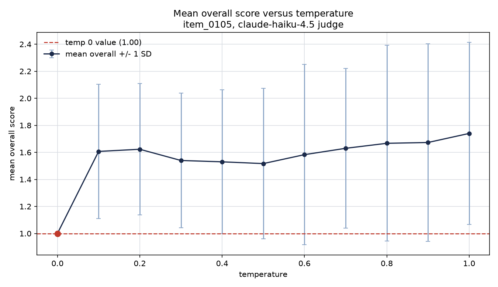

Mean overall score versus temperature, with the temperature-0 value marked. The mean steps up by about 0.6 of a point as soon as temperature is positive, then stays roughly flat.

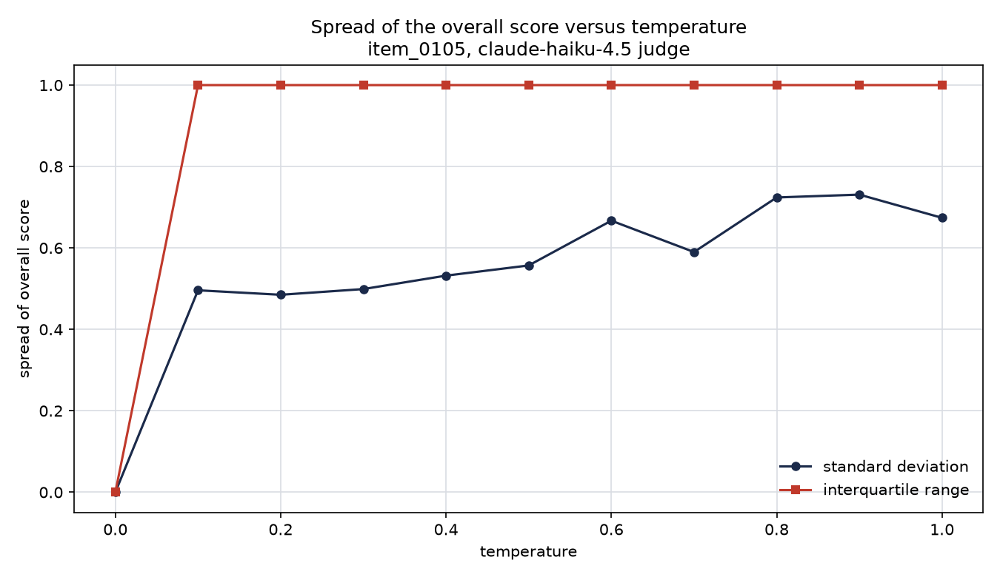

Spread of the overall score versus temperature. The standard deviation rises from 0 at temperature 0 to about 0.7, while the interquartile range stays one point wide.

### Mean and spread by temperature

The table reports, for each temperature, the number of draws, the mean overall
score, the standard deviation and interquartile range of the overall score, the
range of sampled values, and the shift of the mean relative to the temperature-0
value of 1.00. The last column is the fraction of draws in which the model
returned a non-numeric coverage score.

| temperature | draws | mean overall | SD | IQR | min to max | mean minus temp-0 | coverage N/A rate |
|---|---|---|---|---|---|---|---|
| 0.0 | 300 | 1.00 | 0.00 | 0.0 | 1 to 1 | 0.00 | 0.00 |
| 0.1 | 300 | 1.61 | 0.50 | 1.0 | 1 to 3 | 0.61 | 0.00 |
| 0.2 | 300 | 1.62 | 0.49 | 1.0 | 1 to 2 | 0.62 | 0.01 |
| 0.3 | 300 | 1.54 | 0.50 | 1.0 | 1 to 2 | 0.54 | 0.03 |
| 0.4 | 300 | 1.53 | 0.53 | 1.0 | 1 to 3 | 0.53 | 0.06 |
| 0.5 | 300 | 1.52 | 0.56 | 1.0 | 1 to 3 | 0.52 | 0.10 |
| 0.6 | 300 | 1.58 | 0.67 | 1.0 | 1 to 5 | 0.58 | 0.23 |
| 0.7 | 300 | 1.63 | 0.59 | 1.0 | 1 to 4 | 0.63 | 0.26 |
| 0.8 | 300 | 1.67 | 0.72 | 1.0 | 1 to 7 | 0.67 | 0.24 |
| 0.9 | 300 | 1.67 | 0.73 | 1.0 | 1 to 6 | 0.67 | 0.25 |
| 1.0 | 300 | 1.74 | 0.67 | 1.0 | 1 to 5 | 0.74 | 0.22 |

### What this means for the main study

Two conclusions follow. First, at temperature 0 the judges are deterministic, so
the disagreement documented in the main study is real disagreement between models
and not an artifact of sampling noise. Repeating a temperature-0 evaluation would
reproduce the exact same score. Second, raising temperature does not merely add
symmetric noise around the temperature-0 answer. On a passage where the judge sits
at the scale floor it introduces an upward bias in the mean of more than half a
point and a growing rate of schema violations on the hardest dimension. For an
evaluation pipeline the practical guidance is to score at temperature 0: it is
both the most reproducible setting and the one that avoids the floor-effect bias
seen here.

### Caveats

The result is for one passage and one judge model, chosen precisely because it was
the hardest case in the study. That passage sits at the scale floor: the judge
rates it 1 at temperature 0. This shapes the temperature result, because a floored
score can only be pushed upward by sampling, so the upward mean shift seen here is
partly a floor artifact rather than a general property of temperature. Had the
chosen passage sat mid-scale, say around 5, the variation would likely be more
symmetric and the mean shift smaller or in either direction. Characterizing
temperature's effect in general would need a more neutral analysis over passages
spanning the scale rather than this single boundary case, which we do not do here.
The temperature-0 determinism finding, however, is a property of the decoding and
is expected to hold generally for this model. A minor
data-collection note: for temperatures 0.1 through 0.5 part of the sample was
gathered by an earlier strict parser that discarded draws whose coverage score was
non-numeric, so the reported coverage N/A rate for those temperatures understates
the true rate (the sharp step at 0.6, where collection switched to a lenient
parser that keeps such draws, reflects this). The overall-score statistics are
affected only marginally, because the discarded draws carried overall scores of 1
or 2 that are already the dominant values, and the temperature-0 result is not
affected at all.

## Limitations and candor

- Personas stand in for people. The ground truth is made of engineered AI personas,
  not real annotators. They are designed to disagree in human-like ways, but they are
  not a substitute for a real annotation study. The pipeline would run unchanged on
  real human labels.
- One persona model. A single model plays all personas, so their disagreement comes
  from prompts rather than independent minds. One of the judge models shares a
  provider family with the persona model, which could flatter it slightly.
- Prompt sensitivity. Model scores can shift with prompt wording. The versioned
  prompts and the prompt-engineering table make this visible rather than hidden, but
  the absolute numbers are prompt-dependent.
- Temperature-0 determinism. Temperature 0 aids reproducibility but does not guarantee
  identical outputs across model updates, and it captures only one point of each
  model's behavior.
- Cost figures are approximations. The dollar figures use
  a configurable public-price proxy for planning and comparison, not a billing
  statement.
- Threshold calibration. The judges rank passages well but score more generously than
  the normalized human cutoff, so the good-or-bad precision is modest at a fixed
  threshold of 6 for three of the four judges. A production gate would calibrate the
  threshold per model, which is out of scope here.
- Dimension analysis is data-dependent. The pruning of neutrality and readability
  reflects this encyclopedic Wikipedia data, where passages are mostly neutral and
  prose quality is captured well by clarity and structure. A different corpus could
  make either dimension carry more signal, so the analysis is worth rerunning per
  domain.

## What else could be done

- A more detailed, LLM-driven prompt-engineering loop. The current loop is automated
  but rule-based: it diagnoses fixed signals and selects canned corrections. A richer
  extension would take the highest-disagreement cases, where a judge and the human
  overall differ most, collect both the human and the LLM written reasonings for those
  cases, and cluster them to surface the recurring gap types. A separate LLM would
  then rewrite the judge prompt to target those gaps, fed the most-disagreeing cases
  together with their human and LLM rationales so it can revise the prompt against
  concrete evidence rather than threshold rules.
- Does a judge favor its own model family? Because the simulated humans here are
  written by a GPT model, a GPT-based judge might track them more closely than a
  judge from another family, purely from shared style rather than shared taste in
  quality. Running this deliberately, with ground-truth panels generated by several
  different model families and every judge scored against each panel, would measure
  that own-family bias directly. It is out of scope for this study but a clean piece
  of independent research on its own.
- Detecting the generator behind a text. The same setup points at a more speculative
  idea: if judges systematically agree more with text produced by their own model
  family, then the spread of judge scores across families could act as a fingerprint.
  Have a panel of judges from different families score a passage and look at how much
  they diverge, and that divergence pattern might reveal whether the text is
  model-generated at all, and even which family produced it. This is a raw idea, not
  a result, but it is a natural experiment to build on top of the own-family question
  above.
